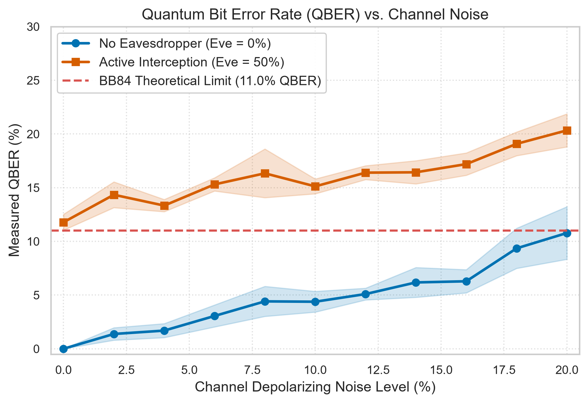
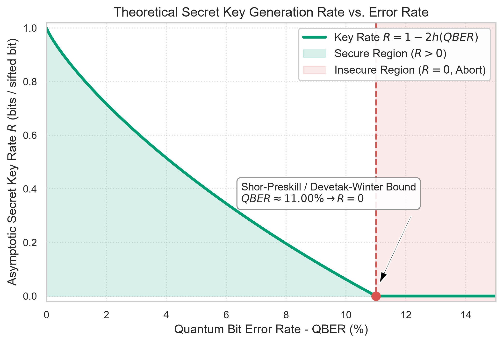
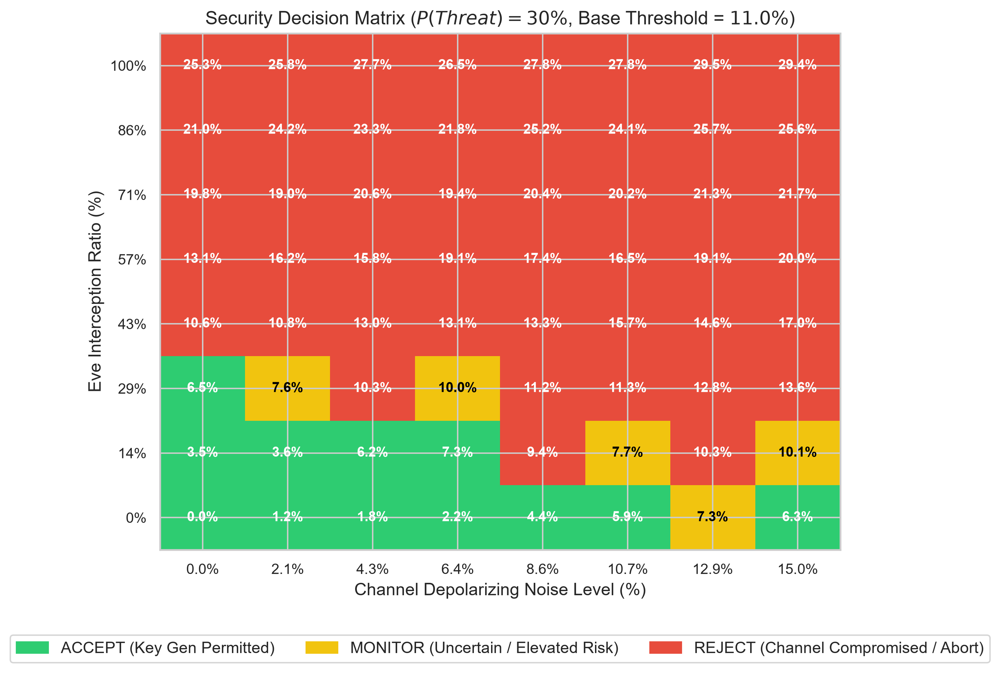

# 🛡️ Quantum-Secure Communication for Biomedical Networks

> **Hackathon Track 2:** Quantum Cryptography and Communication  
> **Application Domain:** Healthcare & Hospital-to-Cloud Telemetry Security  
> **Simulation Engine:** Qiskit >= 1.0 & Qiskit-Aer  

---

## 📋 Problem Statement & Context

Modern healthcare networks transmit critical, highly sensitive patient telemetry—including **Electronic Health Records (EHR)**, high-resolution **DICOM medical imaging**, and real-time **IoMT (Internet of Medical Things) vital streams**—between local hospital clinics, regional diagnostic laboratories, and centralized cloud computing facilities.

Standard public-key cryptographic architectures (e.g., RSA, ECC) are vulnerable to store-now-decrypt-later attacks and future quantum decryption via Shor's algorithm. While **Quantum Key Distribution (QKD)** via the BB84 protocol provides physical-layer information-theoretic security, physical channels are susceptible to environmental noise and man-in-the-middle active interception. Furthermore, classical network perimeter breaches often go unnoticed by physical optical sensors.

**Our Solution:** A **Hybrid Quantum-Classical Security Architecture** that couples real-time **classical threat intelligence** (machine learning classification of network flow anomalies via NSL-KDD) with **BB84 QKD simulation** and an **adaptive risk-aware decision engine**. When network threat levels rise, the system dynamically scales down allowable Quantum Bit Error Rate (QBER) tolerances and adjusts finite-key confidence bounds, preventing key negotiation across compromised or noisy channels.

---

## 🏗️ Architecture & Workflow

```text
               +-------------------------------------------------------------+
               |              HOSPITAL NETWORK DATA FLOWS                    |
               |       (DICOM Imaging, Patient EHR, Telemetry Flows)         |
               +-------------------------------------------------------------+
                                              |
                       +----------------------+----------------------+
                       |                                             |
                       v                                             v
        +-----------------------------+               +-----------------------------+
        |   Classical Threat Layer    |               |    BB84 Quantum Layer       |
        |   (NSL-KDD Threat ML)       |               |    (Qiskit Aer Simulator)   |
        +-----------------------------+               +-----------------------------+
        | - StandardScaler & One-Hot  |               | - Alice State Preparation   |
        | - Logistic Reg (Baseline)   |               |   (|0>, |1>, |+>, |->)      |
        | - Random Forest (Production)|               | - Eve Intercept-Resend Attk |
        | - Extracts Threat P(Attack) |               | - Channel Depolarizing/Phase|
        +-----------------------------+               | - Bob Sifting & Basis Match |
                       |                              | - Basis-Resolved QBER (Z,X) |
                       |                              | - Finite-Key 95% UCB Bound  |
                       |                              +-----------------------------+
                       | P(Attack) in [0, 1]                         |
                       |                                             | QBER, UCB, R
                       +----------------------+----------------------+
                                              |
                                              v
               +-------------------------------------------------------------+
               |            ADAPTIVE SECURITY DECISION ENGINE                |
               |  - Adaptive Ceiling: max_allowed = 11% * (1 - 0.5 * P_att)  |
               |  - Asymptotic Key Rate: R = max(0, 1 - 2*h(QBER))           |
               |  - Finite-Sample Statistical Uncertainty Detection          |
               +-------------------------------------------------------------+
                                              |
                       +----------------------+----------------------+
                       |                      |                      |
                       v                      v                      v
                +-------------+        +-------------+        +-------------+
                |   ACCEPT    |        |   MONITOR   |        |   REJECT    |
                | Key Gen OK  |        | Uncertainty |        | Abort / MITM|
                +-------------+        +-------------+        +-------------+
```

---

## 🚀 Quickstart & Reproduction Guide

### 1. Prerequisites & Environment Setup
Ensure **Python 3.10+** is installed on your system.

```bash
# Clone the repository
git clone https://github.com/Simply-coding-007/Quant_Hospital.git
cd Quant_Hospital

# Create and activate virtual environment
python -m venv .venv
# On Windows PowerShell:
.\.venv\Scripts\Activate.ps1
# On Linux / macOS:
# source .venv/bin/activate

# Install dependencies
pip install -r requirements.txt
```

### 2. Phase 1 & 2: Train Classical Threat Classifier
Downloads NSL-KDD dataset splits, trains the preprocessor, baseline Logistic Regression, and Random Forest classifier, evaluates metrics, and saves model artifacts to `models/`:

```bash
python src/classifier.py
```

### 3. Phase 3: Run BB84 Quantum Simulation Demo & Sanity Test
Runs the physical BB84 protocol in Qiskit Aer with channel noise, active Eve interception, and basis-resolved QBER estimation:

```bash
python src/qkd.py
```

### 4. Phase 4: Execute End-to-End Security Pipeline
Runs 6 multi-vector scenarios across clean, noisy, and eavesdropped channels paired with low- and high-threat network traffic:

```bash
python src/pipeline.py
```

### 5. Phase 5: Generate Publication-Quality Figures (300 DPI)
Generates high-resolution figures in `results/`:

```bash
python generate_plots.py
```

### 6. Phase 6: Launch Interactive Streamlit Dashboard
Launches the interactive real-time visual control dashboard:

```bash
streamlit run app.py
```

---

## 📊 Quantitative Scenario Evaluation

The end-to-end pipeline evaluates 6 operational scenarios combining varying quantum channel conditions and classical network threat levels:

| Scenario | Channel Noise | Eve Intercept | Measured QBER | QBER 95% UCB | Max Allowed QBER | Key Rate $R$ | Threat Score $P(\text{Attack})$ | Security Verdict | Operational Decision |
| :--- | :---: | :---: | :---: | :---: | :---: | :---: | :---: | :---: | :--- |
| **1. Clean Channel + Low Threat** | 1.0% | 0.0% | 0.38% | 0.82% | 10.96% | 0.9277 | 0.8% | **ACCEPT** | Secure channel; key generation approved. |
| **2. Noisy Channel + Low Threat** | 14.0% | 0.0% | 6.92% | 8.83% | 10.96% | 0.2743 | 0.8% | **ACCEPT** | High optical loss, but below threshold; key rate throttled. |
| **3. Eavesdropped + Low Threat** | 1.0% | 40.0% | 10.27% | 12.47% | 10.96% | 0.0449 | 0.8% | **MONITOR** | Statistical uncertainty: point estimate within limit, but UCB exceeds limit. |
| **4. Clean Channel + High Threat** | 1.0% | 0.0% | 0.00% | 0.00% | 5.50% | 1.0000 | 100.0% | **REJECT** | Classical network intrusion detected; key distribution aborted. |
| **5. Mild Noise + Moderate Threat** | 6.0% | 0.0% | 1.18% | 1.97% | 7.43% | 0.8146 | 65.0% | **MONITOR** | Elevated network threat; channel operating within bounds under surveillance. |
| **6. Eavesdropped + High Threat** | 5.0% | 50.0% | 13.49% | 16.04% | 5.50% | 0.0000 | 100.0% | **REJECT** | Multi-vector compromise: optical eavesdropping and network attack. |

---

## 📈 Key Presentation Figures

### Figure 1: QBER vs. Channel Noise Rate
Demonstrates the impact of physical depolarizing noise on measured QBER for clean transmission ($\text{Eve}=0\%$) versus active intercept-resend ($\text{Eve}=50\%$), evaluated against the fundamental BB84 11% theoretical threshold.



### Figure 2: Asymptotic Secret Key Generation Rate
Illustrates the Shor-Preskill / Devetak-Winter secret key rate curve $R = \max(0, 1 - 2h(\text{QBER}))$ with the annotated zero-crossing threshold at $\text{QBER} \approx 11.00\%$.



### Figure 3: 2D Adaptive Security Decision Heatmap
Depicts the 8x8 parameter space (Noise $\times$ Eve ratio) under an active threat score $P(\text{Attack}) = 30\%$, demonstrating the adaptive partitioning between **ACCEPT** (Green), **MONITOR** (Yellow), and **REJECT** (Red).



---

## 🔬 Honest Technical Limitations

1. **Simulation vs. Real Physical Hardware:**
   - All quantum states, channels, and detector operations are simulated using `qiskit` and `qiskit-aer` on classical processors.
   - Real optical fiber links suffer from photon loss (typically $\sim 0.2\text{ dB/km}$ at $1550\text{ nm}$), dark counts, detector dead time, dispersion, and optical polarization drift.
2. **Asymptotic Key Rate vs. Finite-Key Effects:**
   - The theoretical key rate formula $R = \max(0, 1 - 2h(\text{QBER}))$ reflects the asymptotic infinite-key limit under one-way classical error correction and privacy amplification.
   - In realistic finite-length block regimes ($N \sim 10^3 - 10^5$), reconciliation efficiency factors ($f \approx 1.15$) and leftover hashing security parameters ($\varepsilon_{\text{sec}}, \varepsilon_{\text{cor}}$) reduce the secret key yield.
3. **Eavesdropping Threat Model:**
   - Eve is modeled as an individual intercept-resend adversary measuring in random mutually unbiased bases (Z/X).
   - Collective attacks, coherent probe storage in quantum memory, and physical side-channel vulnerabilities (e.g., detector blinding, spatial mode tampering) are not simulated.
4. **Dataset Context & Healthcare Translation:**
   - The classical threat classifier is trained on the NSL-KDD benchmark. While standard in network intrusion research, operational biomedical networks require domain-specific telemetry (e.g., DICOM network protocols, HL7/FHIR message streams, and IoMT device traffic).
5. **No Claim of Quantum Advantage:**
   - Quantum Key Distribution provides physical-layer information-theoretic security guarantees against computational interception, not computational acceleration or "quantum supremacy".

---

## 👥 Engineering Team & Roles
- **ML Engineer:** Classical threat classifier architecture, NSL-KDD preprocessing, pipeline optimization.
- **Quantum Information Engineer:** Qiskit BB84 protocol design, depolarizing/phase-flip noise models, intercept-resend physics.
- **Cybersecurity Architect:** Adaptive risk-decision framework, dynamic QBER threshold scaling, finite-key confidence bounds.
- **Data Visualization Expert:** 300 DPI publication plots, colorblind-safe palettes, Seaborn whitegrid styling.
- **Full-Stack Developer:** Streamlit interactive real-time control dashboard, component architecture, telemetry caching.

---
*Developed for Track 2: Quantum Cryptography and Communication.*
